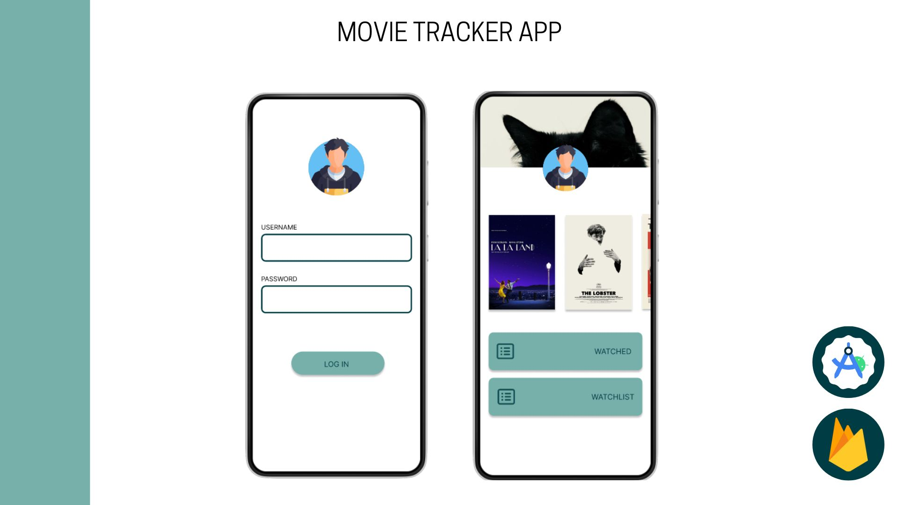

## Movie Tracker App

## Descripción
Movie Tracker es una aplicación de Android desarrollada en Kotlin que permite a los usuarios llevar un seguimiento de las películas que han visto y las que desean ver. Utiliza la API de The Movie Database (TMDB) para proporcionar un amplio catálogo de películas. Los usuarios pueden agregar películas a su lista de seguimiento (watchlist) y a su lista de vistas, donde también pueden añadir una reseña personal y una calificación de 0 a 5 estrellas. La autenticación y el almacenamiento de datos se manejan a través de Firebase.

## Funcionalidades

- **Watchlist**: Permite a los usuarios agregar películas que desean ver en el futuro.
- **Vistas**: Permite a los usuarios agregar películas que han visto, junto con una reseña y una calificación.
- **Catálogo de películas**: Proporcionado por la API de TMDB, permitiendo a los usuarios explorar y buscar películas.
- **Autenticación**: Utiliza Firebase para el registro y autenticación de usuarios.
- **Sincronización de datos**: Las listas de películas se almacenan en Firebase para mantener la consistencia entre diferentes dispositivos.

## Requisitos

- Android Studio
- Kotlin
- API Key de TMDB
- Cuenta de Firebase

## Instalación

  1. Clona el reposotorio:
     ```sh
     git clone https://github.com/tu_usuario/movie-tracker.git
     cd movie-tracker
     ```
  2. Abre el proyecto en Android Studio.
  3. Configura la API Key de TMDB.
  4. Configura Firebase.

  ## Uso
  1. Regístrate o inicia sesión en la aplicación utilizando Firebase Authentication.
  2. Explora el catálogo de películas proporcionado por TMDB.
  3. Agrega películas a tu Watchlist.
  4. Marca las películas como vistas y añade una reseña y una calificación.
